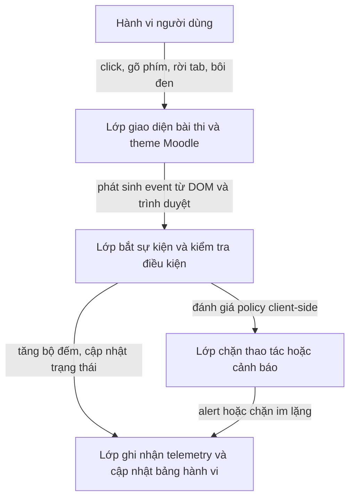
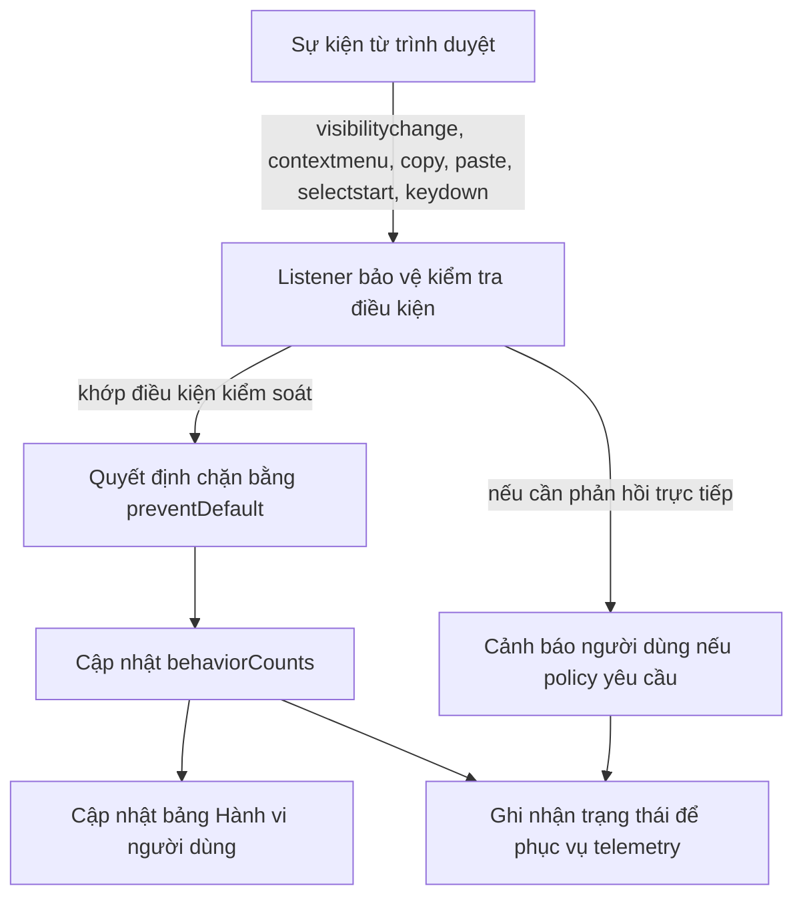

# Phân tích Cơ chế Secure Quiz
> Lưu ý: Tài liệu này phục vụ mục đích nghiên cứu, học tập và phân tích cơ chế bảo vệ ở phía client. Đây không phải là tài liệu hướng dẫn bypass, vượt kiểm soát hay khai thác trên hệ thống thật của [courses.ut.edu.vn](https://courses.ut.edu.vn/).

README này được viết theo hướng một bản ghi chép nghiên cứu kỹ thuật ngắn, nhằm phân tích cơ chế hoạt động của trang quiz bảo mật được mô phỏng trong `demo-tracnghiem.html`, đối chiếu với mẫu trang gốc đã phân tích, và trình bày cách kiểm thử hợp lệ trên môi trường local. Tài liệu phục vụ mục đích nghiên cứu học tập và phòng vệ; nội dung được giới hạn ở phân tích client-side, mô phỏng local, và các đề xuất cải tiến telemetry, không hướng dẫn vượt cơ chế kiểm soát trên hệ thống thật như [courses.ut.edu.vn](https://courses.ut.edu.vn/).

## Tóm tắt nhanh

- Trang quiz gồm hai lớp chính: lớp giao diện/theme của Moodle ở phần `head` và lớp kiểm soát hành vi ở phần JavaScript.
- Các hành vi như rời tab, chuột phải, copy/cut/paste, bôi đen và phím tắt clipboard đều có thể bị chặn ở phía client.
- `demo-tracnghiem.html` giữ lại bố cục Moodle/YUI và mô phỏng các cơ chế chặn để phục vụ kiểm thử local.
- Bảng `Hành vi người dùng` trong sidebar là một lớp telemetry UI đơn giản; nếu triển khai trên hệ thống thật, nên bổ sung log có cấu trúc và biểu diễn nhị phân để tổng hợp sự kiện hiệu quả hơn.

## 1. Bối cảnh hệ thống

Trang đích gốc thuộc hệ thống đào tạo trực tuyến Moodle của trường, với branding `Hệ thống đào tạo trực tuyến` thể hiện trên trang đăng nhập [courses.ut.edu.vn](https://courses.ut.edu.vn/). Bản demo local được dùng để:

- giữ giao diện gần với trang quiz thật;
- quan sát cách event bị chặn trên trình duyệt;
- thử nghiệm telemetry và UI mà không cần tác động lên hệ thống đang vận hành.

## 2. Kiến trúc tổng quát

Có thể xem trang quiz bảo mật gồm ba lớp:



### 2.1 Lớp nạp tài nguyên và khởi tạo môi trường

Phần `head` của trang gốc nạp CSS và bootstrap YUI/Moodle, bao gồm:

- stylesheet YUI/Moodle;
- `firstthemesheet` để làm mốc cho hệ thống chèn CSS động;
- `M.cfg`, `YUI_config`, `M.yui.loader`;
- các script theme/head để body được gán thêm class `jsenabled`.

Trong `demo-tracnghiem.html`, cấu trúc này đã được đưa về gần bản gốc nhất có thể. Vì vậy, các phần như:

- `navbar`;
- `#page`, `#page-header`, `#region-main`;
- `#mod_quiz_navblock`;
- các class như `card`, `qnbutton`, `quiz-timer-inner`

đều phụ thuộc trực tiếp vào CSS của theme Moodle.

Một chi tiết quan trọng cần nhấn mạnh là pipeline nạp JavaScript ở đầu trang. Trong `demo-tracnghiem.html`, cụm script sau thể hiện rõ trình tự khởi tạo front-end:

```41:44:demo-tracnghiem.html
</div><script src="https://courses.ut.edu.vn/lib/javascript.php/1774818002/lib/polyfills/polyfill.js"></script>
<script src="https://courses.ut.edu.vn/theme/yui_combo.php?rollup/3.18.1/yui-moodlesimple-min.js"></script><script src="https://courses.ut.edu.vn/theme/jquery.php/core/jquery-3.7.1.min.js"></script>
<script src="https://courses.ut.edu.vn/lib/javascript.php/1774818002/lib/javascript-static.js"></script>
<script src="https://courses.ut.edu.vn/theme/javascript.php/edly/1774818002/head"></script>
```

Cụm này có thể được hiểu như một pipeline bốn tầng:

- `polyfill.js`: tạo lớp tương thích cho trình duyệt, bảo đảm các API cần thiết tồn tại trước khi các module cao hơn chạy.
- `yui-moodlesimple-min.js`: nạp runtime YUI/Moodle, là lớp hạ tầng cho các module cũ của Moodle và một số utility về DOM/event.
- `jquery-3.7.1.min.js`: bổ sung lớp tiện ích quen thuộc cho plugin và theme; dù không phải phần nào cũng cần jQuery, nó vẫn là dependency quan trọng của hệ thống.
- `javascript-static.js` và `theme/.../head`: nạp logic chung của Moodle và logic theme `edly`, giúp class body, theme behavior, utility và các thành phần UI được đồng bộ.

Nếu nhìn dưới góc độ kiến trúc, đây không chỉ là “nạp thêm script”, mà là một chuỗi khởi tạo có thứ tự. Thứ tự này quan trọng vì:

- theme có thể phụ thuộc vào utility đã được nạp trước;
- module chặn hành vi chỉ ổn định khi hạ tầng DOM/event đã sẵn sàng;
- thay đổi bất kỳ mắt xích nào cũng có thể dẫn đến lệch giao diện hoặc sai hành vi.

### 2.2 Lớp giao diện và nội dung bài thi

Trong `demo-tracnghiem.html`, phần nội dung hiện có:

- một câu trắc nghiệm demo;
- một câu tự luận demo;
- bảng điều hướng câu hỏi ở sidebar;
- bảng theo dõi `Hành vi người dùng`.

Đoạn mã thể hiện câu 1 và câu 2 hiện đang ở file demo:

```72:90:demo-tracnghiem.html
<div id="page-content" class="row">
    <div id="region-main-box" class="col-12">
        <section id="region-main" class="has-blocks" aria-label="Nội dung">
            ...
            <div id="question-3989209-1" class="que multichoice deferredfeedback notyetanswered">
                ...
                <div class="qtext"><p>Đây là câu hỏi demo trắc nghiệm số 1.</p></div>
                ...
```

```90:90:demo-tracnghiem.html
</div><div id="question-3989209-2" class="que essay deferredfeedback notyetanswered"><div class="info"><h3 class="no">Câu hỏi <span class="qno">2</span></h3>...
```

Ý nghĩa của các class/chunk chính:

- `que multichoice`: câu trắc nghiệm một lựa chọn;
- `que essay`: câu tự luận;
- `questionflag editable`: vùng đánh dấu câu hỏi;
- `submitbtns`: vùng điều hướng sang bước tiếp theo.

Ở mức cốt lõi, lớp giao diện này đóng vai trò:

- hiển thị trạng thái câu hỏi;
- làm bề mặt tương tác cho người dùng;
- tạo ra ngữ cảnh DOM để lớp JavaScript có thể bắt sự kiện và áp chính sách.

### 2.3 Lớp bắt sự kiện và ghi nhận hành vi

Phần JavaScript client-side trong bản demo đang chặn và ghi nhận các sự kiện:

```154:219:demo-tracnghiem.html
<script src="https://courses.ut.edu.vn/lib/javascript.php/1774818002/lib/requirejs/require.min.js"></script>
<script>
//<![CDATA[
document.getElementById("responseform").addEventListener("submit", function(e) { e.preventDefault(); });
document.getElementById("quiz-time-left").textContent = "13:23";
var behaviorCounts = {
    visibility: 0,
    contextmenu: 0,
    copy: 0,
    paste: 0,
    selectstart: 0
};
...
document.addEventListener("selectstart", function(e) {
    e.preventDefault();
    behaviorCounts.selectstart += 1;
    updateBehaviorCell("selectstart");
});
//]]>
</script>
```

Nếu xem kỹ đoạn mở đầu của khối này:

```158:166:demo-tracnghiem.html
document.getElementById("responseform").addEventListener("submit", function(e) { e.preventDefault(); });
document.getElementById("quiz-time-left").textContent = "13:23";
var behaviorCounts = {
    visibility: 0,
    contextmenu: 0,
    copy: 0,
    paste: 0,
    selectstart: 0
};
```

Ta thấy ba ý tưởng thiết kế rất rõ:

- `preventDefault()` trên form: biến trang thành một môi trường test quan sát, tránh submit thật và giúp các thao tác trong UI được lặp lại nhiều lần.
- gán sẵn `quiz-time-left`: tách riêng mục đích mô phỏng UI timer khỏi logic timer thật; điều này giữ giao diện “sống” mà không cần backend.
- `behaviorCounts`: sự kiện không chỉ bị chặn, mà còn được biến thành dữ liệu có thể đo đếm. Đây là bước chuyển từ “chặn hành vi” sang “quan sát hành vi”.

Dưới góc nhìn nghiên cứu, `behaviorCounts` là một telemetry accumulator rất nhỏ. Nó không phức tạp, nhưng cho thấy một nguyên lý quan trọng: hệ thống client-side hiệu quả hơn khi không chỉ cản trở, mà còn lưu vết.

Những nhóm hành vi hiện đang được xử lý là:

- `visibilitychange`: cảnh báo khi rời tab;
- `contextmenu`: chặn chuột phải;
- `copy`, `cut`, `paste`: chặn thao tác clipboard;
- `dragstart`: chặn kéo thả;
- `selectstart`: chặn bôi đen;
- `keydown` kết hợp `Ctrl`/`Meta`: chặn phím tắt clipboard.

### 2.4 Dấu hiệu stack kỹ thuật mà đội phát triển đang sử dụng

Nếu đọc tài liệu này theo góc nhìn reverse engineering phòng vệ, có thể nhận ra lớp front-end của hệ thống không phải một ứng dụng đơn khối hiện đại được viết lại hoàn toàn, mà là một kiến trúc tích lũy theo thời gian, trong đó nhiều lớp công nghệ cùng tồn tại để phục vụ tính tương thích vận hành.

Từ các tài nguyên đã được trích dẫn trong `head` và cuối `body`, có thể suy ra ít nhất năm thành phần kỹ thuật nổi bật:

- `Moodle`: đóng vai trò LMS framework, định nghĩa cấu trúc trang, vòng đời page, naming convention và logic quiz nền.
- `YUI`: là lớp di sản nhưng vẫn giữ vai trò quan trọng trong các module cũ, đặc biệt ở khu vực thao tác DOM/event của quiz secure mode.
- `jQuery`: hiện diện như lớp tiện ích bổ sung cho theme/plugin và các hành vi giao diện truyền thống.
- theme `edly`: chi phối bố cục hiển thị, màu sắc, spacing và nhiều class trực quan của trang.
- `RequireJS` cùng các script bootstrap: chịu trách nhiệm nạp module và bảo đảm các thành phần phụ thuộc được khởi tạo theo trật tự.

Nhìn dưới góc độ kỹ thuật hệ thống, đây là một mô hình `legacy-compatible front-end`. Mô hình này thường có ba đặc điểm:

- nhiều runtime cùng hiện diện nhưng không loại bỏ lẫn nhau;
- logic nghiệp vụ phía client được gắn trực tiếp vào DOM/event;
- độ ổn định phụ thuộc mạnh vào thứ tự nạp CSS, JS và khả năng giữ nguyên cấu trúc HTML mà framework kỳ vọng.

Đối với một LMS của trường học, lựa chọn này có lợi thế rõ ràng:

- dễ duy trì tương thích với plugin cũ;
- giảm rủi ro khi nâng cấp từng phần;
- cho phép đội phát triển chèn chính sách kiểm soát vào ngay lớp trình duyệt mà không cần tái thiết kế toàn bộ hệ thống.

Tuy nhiên, nó cũng kéo theo các giới hạn kỹ thuật cần nhìn nhận thẳng:

- bề mặt kiểm soát bị phân tán qua nhiều file và nhiều tầng runtime;
- secure behavior dễ gắn chặt với cấu trúc giao diện hơn là một policy engine độc lập;
- khả năng kiểm chứng mạnh vẫn không thể chỉ dựa vào client-side, vì lớp này thiên về cưỡng chế và quan sát hơn là xác minh tuyệt đối.

## 3. Cơ chế hoạt động cốt lõi

Đây là phần quan trọng nhất của tài liệu. Nếu rút gọn toàn bộ trang thành chuỗi vận hành cốt lõi, ta có thể mô tả theo sáu giai đoạn:

1. Trang tải tài nguyên.
2. DOM được dựng xong.
3. Listener được đăng ký.
4. Người dùng phát sinh hành vi.
5. Hệ thống chặn hoặc cảnh báo.
6. Telemetry/UI được cập nhật.

Sơ đồ dưới đây minh họa chu trình phản ứng:



### 3.1 Giai đoạn 1: Tải tài nguyên

Trình duyệt lần lượt tải:

- CSS nền và theme;
- runtime YUI/Moodle;
- jQuery;
- JavaScript tĩnh và script theme.

Đây là giai đoạn tạo “nền” cho mọi phần phía sau. Nếu giai đoạn này sai:

- giao diện sẽ lệch;
- class/body có thể không khởi tạo đúng;
- các listener phía sau có thể hoạt động thiếu ổn định.

### 3.2 Giai đoạn 2: Dựng DOM

Sau khi tài nguyên được nạp, HTML tạo ra:

- vùng nội dung chính;
- form bài thi;
- câu hỏi trắc nghiệm;
- câu tự luận;
- bảng điều hướng câu hỏi;
- bảng hành vi người dùng.

Đây là điều kiện cần để script cuối trang có thể tìm thấy:

- `responseform`
- `quiz-time-left`
- các ô đếm hành vi như `user-behavior-copy`

### 3.3 Giai đoạn 3: Đăng ký listener

Khi script cuối trang chạy, hệ thống:

- chặn submit form;
- gán giá trị ban đầu cho timer;
- tạo đối tượng `behaviorCounts`;
- gắn hàng loạt listener vào `document`.

Điểm quan trọng là phần này diễn ra sau khi DOM đã hiện diện, nên thao tác `getElementById(...)` hoạt động trực tiếp, không cần thêm bootstrap phức tạp.

### 3.4 Giai đoạn 4: Phát sinh hành vi người dùng

Người dùng có thể:

- rời tab;
- bấm chuột phải;
- copy/paste;
- bôi đen;
- dùng tổ hợp phím clipboard.

Mỗi hành vi như vậy đi vào cùng một mô hình xử lý:

- listener bắt được sự kiện;
- script kiểm tra điều kiện;
- `preventDefault()` nếu cần;
- tăng bộ đếm;
- cập nhật giao diện;
- hiển thị cảnh báo nếu chính sách yêu cầu.

### 3.5 Giai đoạn 5: Chặn hoặc cảnh báo

Không phải hành vi nào cũng bị xử lý giống nhau:

- `visibilitychange`: thiên về cảnh báo khi điều kiện `document.hidden` đúng;
- `contextmenu`, `copy`, `paste`: vừa chặn vừa cảnh báo;
- `selectstart`: chặn và ghi nhận, không nhất thiết phải bật `alert`.

Điều này cho thấy trang đang dùng nhiều mức phản hồi:

- mức 1: chặn im lặng;
- mức 2: chặn và thông báo;
- mức 3: chặn, thông báo, và ghi nhận telemetry.

### 3.6 Giai đoạn 6: Cập nhật telemetry

Sau khi chặn sự kiện, hệ thống cập nhật bộ đếm và phản ánh ngay trong bảng `Hành vi người dùng`.

Đây là bước có giá trị nghiên cứu lớn nhất, vì nó biến hành vi tức thời thành dữ liệu có thể:

- nhìn thấy;
- thống kê;
- so sánh;
- tổng hợp thành mẫu.

## 4. Mô hình use case và trách nhiệm hệ thống

Để tài liệu đạt mức của một bản phân tích nghiên cứu hệ thống, không nên chỉ nhìn theo chuỗi sự kiện kỹ thuật. Cần nhìn thêm theo góc độ tác nhân, trách nhiệm từng lớp, và quan hệ giữa hành vi người dùng với tầng cưỡng chế phía client. Phần này trình bày hệ thống như một tập các use case vận hành thay vì chỉ là một tập listener rời rạc.

### 4.1 Các tác nhân chính

- `Người làm bài`: nguồn phát sinh thao tác thật, bao gồm click, gõ phím, chuyển tab, chọn văn bản và tương tác với form.
- `Trình duyệt`: môi trường thực thi event model, phát sinh `visibilitychange`, `contextmenu`, `copy`, `paste`, `keydown` và quản lý vòng đời DOM.
- `Lớp kiểm soát client`: tập hợp listener, `preventDefault()`, `alert()` và logic cập nhật bộ đếm trong `demo-tracnghiem.html`.
- `Telemetry nội bộ`: bảng `Hành vi người dùng`, `behaviorCounts`, và hướng mở rộng sang bitmask hoặc log có timestamp.
- `Đội dev hệ thống`: bên thiết kế policy, quan sát tín hiệu hành vi, và quyết định mức độ ràng buộc hay cách tổng hợp dữ liệu.

### 4.2 Sơ đồ use case tổng thể

```text
+------------------+      +------------------+      +----------------------+
| Người làm bài    |      | Trình duyệt      |      | Đội dev hệ thống     |
+------------------+      +------------------+      +----------------------+
         |                           |                           |
         +------------+--------------+                           |
                      |                                          |
                      v                                          v
        +-----------------------------------+      +-------------------------------+
        | 1. Khởi tạo phiên làm bài         |      | 4. Phân tích tín hiệu         |
        | - Mở bài thi và tải tài nguyên    |<-----| - Đọc bảng hành vi            |
        | - Dựng giao diện Moodle/theme     |      | - Đọc log kỹ thuật / bitmask  |
        | - Đăng ký listener bảo vệ         |      | - Tinh chỉnh ngưỡng/policy    |
        +-----------------------------------+      +-------------------------------+
                      |
                      v
        +-----------------------------------+
        | 2. Kiểm soát tương tác phía client|
        | - Phát hiện rời tab               |
        | - Chặn chuột phải                 |
        | - Chặn copy/cut/paste             |
        | - Chặn bôi đen văn bản            |
        | - Chặn phím tắt clipboard         |
        +-----------------------------------+
                      |
                      v
        +-----------------------------------+
        | 3. Ghi nhận hành vi               |
        | - Cập nhật bảng hành vi người dùng|
        | - Ghi nhận cờ nhị phân / log      |
        | - Chuẩn bị dữ liệu cho phân tích  |
        +-----------------------------------+
                      |
                      +------------------------------------------> 4
```

### 4.3 Diễn giải use case theo ngôn ngữ nghiên cứu hệ thống

- `Mở bài thi và tải tài nguyên`: use case khởi tạo toàn bộ bề mặt kiểm soát; nếu thất bại ở đây, mọi lớp phía sau đều mất nền thực thi.
- `Dựng giao diện Moodle và theme`: use case bảo đảm cấu trúc DOM đủ chuẩn để lớp chính sách tìm đúng node và gắn đúng event surface.
- `Đăng ký listener bảo vệ`: đây là thời điểm policy client được “gắn” vào phiên làm bài; từ đây mọi hành vi tương tác bắt đầu đi qua một lớp cưỡng chế.
- `Phát hiện rời tab`: use case thu tín hiệu mất hiện diện khỏi không gian làm bài; giá trị chính là tín hiệu hành vi, không phải chỉ là `alert`.
- `Chặn chuột phải`, `chặn clipboard`, `chặn bôi đen`, `chặn phím tắt`: đây là các use case kiểm soát vi mô, nhằm giảm khả năng thao tác ngoài ý định của policy.
- `Cập nhật bảng hành vi người dùng`: use case biến cưỡng chế thành khả năng quan sát cục bộ, phục vụ test, debug và đối chiếu hành vi.
- `Ghi nhận cờ nhị phân và log kỹ thuật`: use case quan trọng nhất nếu nhìn theo hướng phòng vệ hiện đại, vì nó chuẩn hóa tín hiệu để máy có thể tổng hợp.
- `Phân tích tín hiệu để tinh chỉnh chính sách`: đây là use case thuộc về đội dev, nơi dữ liệu hành vi được chuyển hóa thành điều chỉnh ngưỡng, luật hoặc chiến lược cảnh báo.

### 4.4 Ranh giới trách nhiệm giữa các lớp

Một tài liệu nghiên cứu tốt cần phân biệt rõ bốn lớp vai trò, vì nếu trộn chúng vào nhau sẽ rất khó đánh giá đúng hiệu quả hệ thống:

- `UI deterrence`: lớp cản trở trực quan, làm người dùng nhận ra rằng hệ thống có policy giới hạn.
- `Event interception`: lớp chặn ở mức API sự kiện của trình duyệt, nơi `preventDefault()` và điều kiện kiểm tra được áp dụng.
- `Behavior telemetry`: lớp biến hành vi thành dữ liệu có thể đo, đếm, so sánh và lưu trữ.
- `Server-side judgment`: lớp phán đoán tin cậy hơn, nơi policy thực sự nên được kết luận nếu hệ thống triển khai ở môi trường thật.

Nếu chỉ có `UI deterrence` mà không có `behavior telemetry`, hệ thống chỉ gây cản trở mà gần như không học được gì từ hành vi. Nếu có telemetry nhưng thiếu tầng phán đoán phía server, hệ thống vẫn khó đạt độ tin cậy cao trong quyết định nghiệp vụ.

## 5. Phân tích chi tiết từng lớp kiểm soát

### 5.1 Cảnh báo rời tab

Khi `document.hidden === true`, script:

- tăng bộ đếm `visibility`;
- cập nhật bảng hành vi người dùng;
- hiện `alert`.

Tác dụng:

- có thể phát hiện người dùng chuyển tab, ẩn cửa sổ, hoặc mất focus theo cách trình duyệt đánh dấu;
- dễ triển khai;
- nhưng dễ gây phiền toái do `alert` khóa luồng tương tác.

Hạn chế:

- hoàn toàn phía client;
- có thể phát sinh false positive;
- không đủ để kết luận hành vi bất thường nếu không kết hợp telemetry khác.

### 5.2 Chặn chuột phải

Sự kiện `contextmenu` bị `preventDefault()` và hiển thị cảnh báo.

Ý nghĩa:

- ngăn menu chuột phải mặc định;
- làm giảm một số thao tác copy nhanh;
- nhưng không nên xem là cơ chế bảo mật mạnh, vì nó chỉ tác động lên lớp UI của trình duyệt.

### 5.3 Chặn copy/cut/paste

Với `copy`, `cut`, `paste`, trang:

- chặn event;
- tăng bộ đếm tương ứng nếu có cấu hình ghi nhận;
- hiện thông báo cho người dùng.

Tác dụng thực tế:

- giúp người dùng hiểu rằng hệ thống đang áp dụng chính sách hạn chế;
- đồng thời cung cấp dữ liệu về tần suất cố gắng thao tác clipboard.

### 5.4 Chặn bôi đen văn bản

Với `selectstart`, trang:

- chặn event;
- tăng bộ đếm `selectstart`;
- thường không cần thông báo bằng `alert`.

Trong các hệ thống quiz, đây là cách phổ biến để giảm thao tác copy từ chọn văn bản. Tuy vậy, giá trị đáng chú ý hơn là việc hành vi này được ghi nhận như một tín hiệu.

### 5.5 Chặn phím tắt clipboard

Script bắt `keydown` và kiểm tra:

- `Ctrl + C`;
- `Ctrl + V`;
- `Ctrl + X`;
- hoặc `Meta` trên hệ điều hành có phím command.

Nếu khớp:

- `preventDefault()`;
- hiển thị cảnh báo tính năng bị vô hiệu hóa.

Lớp này cho thấy logic kiểm soát không chỉ nhìn vào thao tác chuột mà còn bao phủ cả luồng bàn phím.

## 6. Ca sử dụng kỹ thuật theo chuỗi sự kiện

Các ca sử dụng dưới đây được viết theo hướng phân tích chuyên sâu: mỗi ca đều tách điều kiện khởi phát, tín hiệu trình duyệt, listener phản ứng, phản hồi UI và giá trị telemetry.

### 6.1 Ca sử dụng 1: Người dùng mở bài thi

- `Điều kiện khởi phát`: người dùng truy cập trang quiz demo.
- `Event gốc`: trình duyệt tải HTML, CSS, JS và hoàn tất việc dựng DOM.
- `Listener phản ứng`: chưa phải listener tương tác người dùng, mà là chuỗi bootstrap của page và script cuối file.
- `Phản hồi UI`: timer được gán giá trị, form ở trạng thái sẵn sàng, sidebar và bảng hành vi xuất hiện.
- `Dữ liệu được ghi nhận`: bộ đếm được khởi tạo về trạng thái zero; đây là mốc nền của toàn bộ phiên.
- `Giới hạn client-side`: nếu chỉ quan sát ở client, hệ thống mới biết trang đã sẵn sàng, chưa biết chất lượng hay độ tin cậy của phiên.

### 6.2 Ca sử dụng 2: Người dùng rời tab

- `Điều kiện khởi phát`: cửa sổ hoặc tab mất hiện diện, làm `document.hidden` chuyển sang `true`.
- `Event gốc`: `visibilitychange`.
- `Listener phản ứng`: listener trên `document` kiểm tra trạng thái hidden rồi tăng bộ đếm và phát cảnh báo.
- `Phản hồi UI`: người dùng bị ngắt luồng bằng `alert`, bảng hành vi tăng ô `Rời tab`.
- `Dữ liệu được ghi nhận`: tăng `behaviorCounts.visibility`; nếu mở rộng, có thể bật bit tương ứng trong `behaviorMask`.
- `Giới hạn client-side`: không phân biệt được đầy đủ giữa hành vi cố ý và các tình huống hợp lệ như chuyển app ngắn, thông báo hệ điều hành, hoặc thay đổi focus ngoài chủ đích.

### 6.3 Ca sử dụng 3: Người dùng thử chuột phải

- `Điều kiện khởi phát`: click chuột phải trong vùng tài liệu.
- `Event gốc`: `contextmenu`.
- `Listener phản ứng`: listener chặn menu mặc định bằng `preventDefault()` rồi tăng bộ đếm.
- `Phản hồi UI`: menu chuột phải không hiện ra; có thể có cảnh báo tùy policy đang mô phỏng.
- `Dữ liệu được ghi nhận`: tăng bộ đếm `contextmenu`, là một tín hiệu hành vi có giá trị cao vì nó mang tính chủ động.
- `Giới hạn client-side`: tín hiệu này cho biết nỗ lực tương tác, nhưng không tự thân chứng minh ý định vi phạm.

### 6.4 Ca sử dụng 4: Người dùng thử copy, paste hoặc phím tắt clipboard

- `Điều kiện khởi phát`: người dùng phát sinh `copy`, `cut`, `paste` hoặc tổ hợp `Ctrl`/`Meta` kèm phím clipboard.
- `Event gốc`: `copy`, `cut`, `paste`, `keydown`.
- `Listener phản ứng`: listener chặn thao tác, kiểm tra modifier key nếu là bàn phím, sau đó cập nhật đếm và kích hoạt thông báo nếu có.
- `Phản hồi UI`: thao tác không xảy ra như bình thường; người dùng nhận thấy chính sách bị áp đặt ở mức thao tác vi mô.
- `Dữ liệu được ghi nhận`: bộ đếm từng nhóm sự kiện hoặc bit tương ứng trong mô hình nhị phân.
- `Giới hạn client-side`: thao tác bị chặn ở lớp trình duyệt không đồng nghĩa hệ thống đã có được một phán đoán đáng tin cậy; cần chuỗi sự kiện, thời gian và bối cảnh để kết luận tốt hơn.

### 6.5 Ca sử dụng 5: Người dùng thử bôi đen văn bản

- `Điều kiện khởi phát`: người dùng kéo chuột hoặc thao tác chọn văn bản.
- `Event gốc`: `selectstart`.
- `Listener phản ứng`: listener chặn ngay ở thời điểm bắt đầu chọn.
- `Phản hồi UI`: văn bản không vào trạng thái được bôi đen; thường không cần `alert` vì mục tiêu là cưỡng chế im lặng để giảm gián đoạn.
- `Dữ liệu được ghi nhận`: tăng `behaviorCounts.selectstart`, tạo ra một tín hiệu nhẹ nhưng hữu ích trong phân tích tần suất.
- `Giới hạn client-side`: đây là tín hiệu có độ mơ hồ cao hơn `contextmenu` vì có thể xuất hiện từ thao tác vô thức hoặc thói quen sử dụng bình thường.

### 6.6 Ca sử dụng 6: Đội dev đọc telemetry và điều chỉnh chính sách

- `Điều kiện khởi phát`: dữ liệu hành vi đã được gom qua bộ đếm UI hoặc bitmask/log kỹ thuật.
- `Event gốc`: không còn là event trình duyệt đơn lẻ, mà là một chuỗi tín hiệu đã được tích lũy qua phiên.
- `Listener phản ứng`: ở mức nghiên cứu, đây là lớp phân tích ngoài runtime; trong hệ thống hoàn chỉnh, nó có thể là dashboard, pipeline log hoặc rule engine.
- `Phản hồi UI`: có thể không phản hồi trực tiếp với người dùng, mà phản ánh ở thay đổi policy hoặc cách cảnh báo trong các phiên sau.
- `Dữ liệu được ghi nhận`: tần suất, chuỗi lặp, cụm hành vi sát thời gian, trạng thái bitmask sau mỗi biến cố.
- `Giới hạn client-side`: nếu không đẩy dữ liệu sang tầng tổng hợp cao hơn, đội dev chỉ nhìn được triệu chứng cục bộ chứ chưa nhìn thấy mẫu hành vi trên diện rộng.

## 7. Bảng câu hỏi và sidebar

Khung `Bảng câu hỏi` là một phần quan trọng của bố cục và là nơi dễ phát sinh sai lệch CSS nếu không giữ đúng DOM/class Moodle.

Trong demo hiện tại, cấu trúc card phải đã được giữ sát bản gốc:

```100:118:demo-tracnghiem.html
<section data-region="blocks-column" aria-label="Các khối">
    <aside id="block-region-side-pre" class="block-region" data-blockregion="side-pre" data-droptarget="1"><h2 class="sr-only">Các khối</h2><a href="#sb-1" class="sr-only sr-only-focusable">Bỏ qua Bảng câu hỏi</a>

<section id="mod_quiz_navblock"
     class=" block block_fake  card mb-3"
     role="navigation"
...
```

Và bên trong card:

- `#quiznojswarning`;
- `qn_buttons clearfix multipages`;
- `othernav`;
- bảng `Hành vi người dùng`.

Bảng `Hành vi người dùng` là phần có giá trị nghiên cứu cao nhất của bản demo hiện tại, vì nó đóng vai trò như một lớp telemetry trực quan trong UI:

- người xem có thể kiểm tra event nào xảy ra nhiều;
- có thể đối chiếu giữa hành vi thật và thông báo của trang;
- có thể sử dụng bảng này như một dashboard mini trong local test.

Nếu bố cục/card phải bị lệch màu nền, nguyên nhân phổ biến thường là:

- bổ sung CSS custom không cần thiết;
- thay đổi DOM quanh `card-body`, `card-text`;
- chèn thêm phần tử mới không theo spacing của theme.

## 8. So sánh trang gốc và bản demo

### 8.1 Điểm giống

- cùng bố cục header + main region + blocks column;
- cùng tên class Moodle quan trọng;
- cùng pattern chặn event phía client;
- cùng sidebar điều hướng câu hỏi;
- cùng timer và submit form.

### 8.2 Điểm mô phỏng

- nội dung câu hỏi đã được đổi thành `demo`;
- một số hidden input vẫn giữ kiểu dữ liệu gốc để phục vụ giao diện;
- script cuối file đã được giản lược cho local, nhưng vẫn giữ logic chặn event và đo đếm hành vi;
- bảng `Hành vi người dùng` là phần phục vụ quan sát, không phải thành phần gốc của trang thật.

## 9. Vì sao bảng nhị phân trong console hiệu quả hơn

Bảng đếm UI hữu ích để xem nhanh, nhưng nếu muốn tổng hợp hành vi hiệu quả hơn thì nên bổ sung biểu diễn nhị phân (bitmask) trong `console` hoặc telemetry. Dưới góc nhìn nghiên cứu, đây là bước chuyển từ “quan sát thủ công” sang “biểu diễn máy đọc được”.

### 9.1 Ý tưởng

Gán mỗi hành vi một bit:

- `1 << 0`: rời tab
- `1 << 1`: chuột phải
- `1 << 2`: copy
- `1 << 3`: paste
- `1 << 4`: bôi đen
- `1 << 5`: cut
- `1 << 6`: dragstart
- `1 << 7`: clipboard shortcut

Khi có hành vi xảy ra:

- bật bit tương ứng;
- ghi log thêm timestamp và lần xuất hiện.

Ví dụ:

```js
const BehaviorBits = {
  visibility: 1 << 0,
  contextmenu: 1 << 1,
  copy: 1 << 2,
  paste: 1 << 3,
  selectstart: 1 << 4
};

let behaviorMask = 0;
behaviorMask |= BehaviorBits.copy;
console.log("behaviorMask", behaviorMask.toString(2).padStart(8, "0"));
```

### 9.2 Lợi ích

- giảm chi phí tổng hợp trạng thái hiện tại;
- dễ lưu telemetry gọn hơn;
- dễ so khớp pattern bất thường;
- dễ vẽ dashboard/báo cáo theo phiên;
- giúp server-side rule engine xử lý nhanh hơn nếu cần.

Nếu viết theo phong cách nghiên cứu hệ thống, biểu diễn nhị phân có ba ưu điểm nổi bật:

- `Tính cố định`: mỗi bit có nghĩa rõ ràng, tránh mơ hồ hoặc log text tự do.
- `Tính tổng hợp`: có thể gộp nhiều hành vi vào một giá trị trạng thái duy nhất.
- `Tính so sánh`: dễ đối chiếu giữa các phiên, người dùng, và mốc thời gian.

### 9.3 Khi nào dùng bảng đếm trực quan, khi nào dùng bitmask

- Bảng UI: dùng để nhìn nhanh trong local/demo, phục vụ manual testing.
- Bitmask/console log: dùng để tổng hợp, lưu vết, và phân tích hành vi theo phiên.
- Hệ thống thật nên dùng cả hai: UI nhẹ cho debug nội bộ, bitmask + timestamp cho telemetry.

## 10. Checklist kiểm thử hợp lệ trên local/demo

Tất cả bài test dưới đây chỉ nên thực hiện trên `demo-tracnghiem.html`.

### 10.1 Kiểm thử giao diện

- mở `demo-tracnghiem.html`;
- xác nhận header, timer, `Bảng câu hỏi`, và hai câu hỏi hiển thị đúng;
- xác nhận bảng `Hành vi người dùng` nằm dưới `Làm xong ...`.

### 10.2 Kiểm thử rời tab

- chuyển sang tab khác;
- quay lại;
- xác nhận có cảnh báo và bộ đếm `Rời tab` tăng.

### 10.3 Kiểm thử chuột phải

- bấm chuột phải trong trang;
- xác nhận menu mặc định không mở;
- bộ đếm `Chuột phải` tăng.

### 10.4 Kiểm thử copy/paste/bôi đen

- thử bôi đen văn bản;
- thử `Ctrl + C`, `Ctrl + V`;
- xác nhận bộ đếm trong bảng tăng đúng theo từng loại.

### 10.5 Kiểm thử trắc nghiệm và tự luận

- chọn một đáp án ở câu 1;
- nhập văn bản vào câu 2;
- nhấn `Trang tiếp`;
- xác nhận form không submit thật trong local demo.

### 10.6 Kiểm thử userscript local

Nếu có sử dụng userscript local, chỉ nên dùng trên file demo local. Không mở rộng sang domain thật. Cần kiểm tra:

- script có đúng file `@match`;
- có thể bật/tắt công tắc bypass local;
- khi tắt bypass, page trở lại hành vi chặn mặc định;
- khi bật bypass, page cho phép test UX không bị `alert` làm gián đoạn.

## 11. Đề xuất cải tiến phòng vệ hiệu quả hơn

Nếu xây dựng hệ thống thật, không nên dựa hoàn toàn vào client-side blocking.

### 11.1 Telemetry có timestamp

Mỗi sự kiện nên ghi:

- `attemptId`
- `userId`
- `eventType`
- `timestamp`
- `page`
- `questionId`
- `maskAfterEvent`

### 11.2 Tổng hợp theo phiên

Cần theo dõi:

- tần suất rời tab;
- chuỗi sự kiện sát nhau trong thời gian ngắn;
- hành vi lặp lại có hệ thống;
- sự khác biệt giữa người dùng thường và phiên bất thường.

### 11.3 Không chặn UI như cách duy nhất

Chặn `copy/paste/contextmenu` chỉ nên là lớp cản trở UI. Các quyết định nghiệp vụ quan trọng nên dựa trên:

- telemetry;
- quy tắc server-side;
- lịch sử phiên;
- đánh giá rủi ro tổng hợp.

### 11.4 Tách chế độ research/demo

Nên có hai mode rõ ràng:

- `production mode`: ghi telemetry, thông báo người dùng, và tắt các công cụ debug;
- `demo/test mode`: cho phép theo dõi, in log, bật UI table, và sử dụng test script chỉ trong môi trường kiểm thử.

## 12. Kết luận

Cơ chế secure quiz được mô phỏng trong dự án này cho thấy một mẫu thiết kế quen thuộc:

- layout Moodle/YUI giữ vai trò hiển thị và bố cục;
- JavaScript client-side xử lý event để cảnh báo và chặn thao tác;
- telemetry có thể được nâng cấp đáng kể nếu dùng thêm bitmask/binary flags và log có timestamp.

Với mục tiêu học tập, `demo-tracnghiem.html` là môi trường phù hợp để:

- đọc và hiểu luồng xử lý event;
- kiểm thử UI/UX của chế độ secure;
- đánh giá điểm mạnh, điểm yếu của client-side blocking;
- thử nghiệm hướng telemetry phòng vệ hiệu quả hơn.

## 13. Góc nhìn nghiên cứu

Nếu xem tài liệu này như một nghiên cứu nhỏ về cơ chế secure quiz client-side, có thể rút ra bốn nhận xét:

### 13.1 Đây là một kiến trúc thiên về cản trở hơn là xác minh

Phần lớn cơ chế hiện tại tập trung vào:

- chặn thao tác;
- cảnh báo người dùng;
- làm tăng chi phí thao tác.

Nó chưa phải là một kiến trúc xác minh mạnh, vì các quyết định quan trọng vẫn cần telemetry và logic server-side.

### 13.2 Giá trị lớn nhất nằm ở dấu vết hành vi

Đoạn `behaviorCounts` trong `demo-tracnghiem.html` là một minh họa rất rõ: ngay khi hệ thống có thể biến event thành dữ liệu, nó bắt đầu có giá trị phân tích cao hơn rất nhiều so với việc chỉ hiện `alert`.

### 13.3 UI cản trở và telemetry nên tách vai trò

- UI cản trở: giúp người dùng nhận ra policy.
- Telemetry: giúp hệ thống đánh giá rủi ro.

Nếu trộn hai vai trò vào một, hệ thống dễ vừa gây phiền toái cho người dùng vừa kém hiệu quả trong phân tích.

### 13.4 Bản demo có giá trị học tập cao

Việc giữ bố cục sát bản gốc nhưng đổi nội dung thành `demo` giúp:

- phân tích code dễ hơn;
- thử nghiệm event an toàn hơn;
- viết tài liệu kỹ thuật rõ ràng hơn;
- tách dữ liệu nghiên cứu khỏi nội dung thật của hệ thống.
### 14. Tác giả
- Github: [Kaiyodev](github.com/kaiyodev)
- Mail: [sadboydev06@gmail.com](mailto:sadboydev06@gmail.com)
